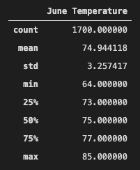
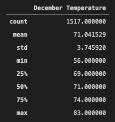
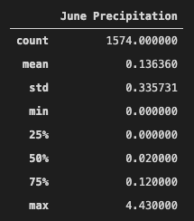
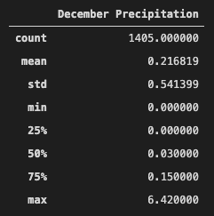

# Surfs_Up
## Overview of the statistical analysis
W. Avy would like to invest in a surf and ice cream shop on the Hawaiian island of Oahu but he has concerns about how the weather will affect the business and the grand opening.  In order to determine if a surf and ice cream shop business is sustainable year-round in Oahu, we needed to perform our analysis specifically for the months of June and December.  By running analytics on a weather dataset gathered for Oahu, we can help W. Avy make an intelligent decision on when to open the surf and ice cream shop based on the weather.

## Results
By analyzing the Oahu weather dataset, we found three key differences in weather between June and December.

- The average, or mean, temperature in June (74.9 degrees) is about 4 degrees warmer than in December (71.0 degrees).
- The minimum temperature recorded in June (64 degrees) was 8 degrees warmer than it was in December (56 degrees) and the maximum temperature recorded in June (85 degrees) was 2 degrees warmer than it was in December (83 degrees).
- Each temperature percentile, 25th%, 50th% and 75th%, for the month of June is 3 to 4 degrees warmer than that for the month of December.

Also, it’s worth noting that in the month of June we had 183 more records (readings) than we did in the month of December so I would suspect that the June values are slightly more accurate than the December values.

## Summary
By analyzing the temperature data it’s clear that the month of June would be the more ideal month to open a surf and ice cream shop.  June had a warmer average temperature and the higher minimum temperature which is ideal for busy days on the beach.  The warmer the day on Oahu the more likely people would go out to the beach to surf and the better ice cream would sell.  

Taking the analysis one step further and creating two new queries, in a similar way we queried for the temperature statistics, I created an analysis of the precipitation on Oahu for the months of June and December.  The precipitation data suggest that June is on average dryer than December as well as has a lower standard deviation.  In conclusion, the month of June on Oahu would be the most ideal time to open the surf and ice cream shop to allow for maximum exposure to the beach crowd!

